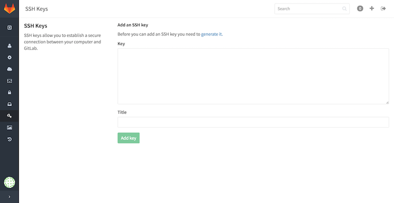
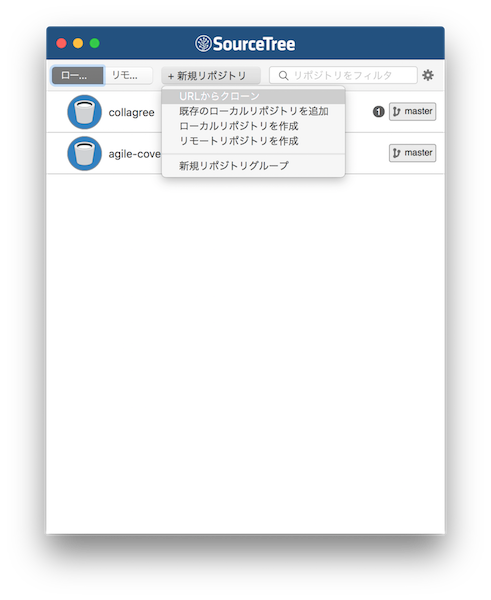
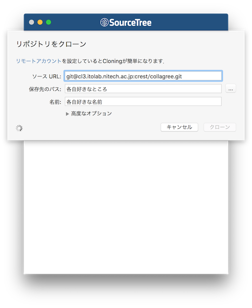

# COLLAGREE セットアップ手順 edited by Yoshino 
MacでCOLLAGREEを運用するための環境構築手順です。   
買ったばかりのMacから本番で運用に至るまでの全手順です。    
※これは一例であり、全ての環境下で下記の通りうまくいくとは限りません。エラー等は各自調べて対処して下さい。    
## 流れ  
0.[Xcode,Homebrew のインストール](#section0)  
1.[Ruby,Ruby on Rails のインストール](#section1)  
2.[その他必要なものをインストール](#section2)  
3.[GitLabへの登録から、クローンまで](#section3)  
4.[ローカルでCOLLAGREEが動作するように設定](#section4)  
5.[起動方法](#section5)  
6.[本番サーバでの運用](#section6)  


## 手順   
<a id="section0"></a>  
### 0. Xcode,Homebrew のインストール  
まずは下準備としてAppStoreで[Xcodeをインストール](https://itunes.apple.com/jp/app/xcode/id497799835?mt=12)しましょう。   
次に[Homebrew](http://brew.sh/index_ja.html)をインストールしましょう。  
ターミナルで以下のコマンドを実行  
```
$ /usr/bin/ruby -e "$(curl -fsSL https://raw.githubusercontent.com/Homebrew/install/master/install)"
```
以下のコマンドで無事にインストールできているか確認する。
```
$ brew doctor  
Your system is ready to brew. <ー こう出ればOKです。
```
念のために最新版にアップデート  
```
$ brew update
```
以上で下準備は完了です。  
<a id="section1"></a>  
### 1. Ruby,Ruby on Rails のインストール  
#### 1.0. rbenv のインストール  
rbenv は ruby のバージョンを管理するツールで、バージョンの切り替えが楽になりますので、まずこれをbrew でインストールします。
```
$ brew install rbenv
```  
パスをつなぎます
```
$ echo 'export PATH="$HOME/.rbenv/bin:$PATH"' >> ~/.bash_profile  
$ echo 'if which rbenv > /dev/null; then eval "$(rbenv init -)"; fi' >> ~/.bash_profile  
```  
他、必要なものをインストールします。  
rubyのインストールを簡単にするツール（rbenvと一緒に入ってるかも）  
```
$ brew install ruby-build
```
gemを管理するツール  
```
$ brew install rbenv-gemset
```  
sourceを.bash_profileに設定
```
$ source ~/.bash_profile
```  
以上でrbenv を導入できました。次はruby の導入です。  
#### 1.1. ruby のインストール  
先ほど導入したrbenv を使ってruby(ここでは2.2.0を使います。) をインストールします。
```
$ rbenv install 2.2.0
```  
デフォルトのバージョンを設定(ここでも2.2.0を使います。)
```
$ rbenv global 2.2.0
```
プロジェクトごとにgem(Ruby言語で書かれたプログラムをより便利にするためのツール(ライブラリ)が簡単に使えるようにするパッケージ管理システム) を管理してくれるgem をインストールします。
```
$ gem install bundler
```
以上でruby の導入は完了です。次はRuby on Rails です。  

#### 1.2. Ruby on Rails のインストール  


<a id="section2"></a>  
### 2. その他必要なものをインストール  
COLLAGREE に必要なものをbrew でインストールしていきます。  
#### 2.1. MySQL
データベースのMySQL をbrew でインストールします。
```
$ brew install mysql
```
#### 2.2. MeCab
形態素解析ツールをMeCab をbrew でインストールします。
```
$ brew install mecab  
$ brew install mecab-ipadic
```
#### 2.3. Redis
ポイントランキングを管理しているデータベースRedis をbrew でインストールします。
```
$ brew install redis
```

<a id="section3"></a>  
### 3. GitLabへの登録から、クローンまで  
COLLAGREE はgit(GitLab) で管理されています。  
[https://cl3.itolab.nitech.ac.jp/gitlab/crest/collagree](https://cl3.itolab.nitech.ac.jp/gitlab/crest/collagree
)  
そのため、開発を進めるためにはプログラムをGitLab から持ってこないといけません。なので、まず誰かにGitLab に招待してもらいましょう。招待されるとメールが届きます。そのメールにあるリンクからGitLab のWEBページにアクセスし、ssh key を登録しなければいけません。(ssh key は、コンピュータとGitLab間の安全な接続を可能にするものです。)

以下は、(アカウントがない場合はアカウント登録をしてから)ssh key を生成し、登録するまでの手順です。
#### 3.1. 鍵を生成  \([参照](http://qiita.com/shizuma/items/2b2f873a0034839e47ce)\)
ディレクトリを移動します。  
```
$ cd ~/.ssh
```
次のコマンドで鍵を生成します。
```
$ ssh-keygen -t rsa
```
実行すると3回ほど何かしら聞かれますが、全てエンターでOKです。
```
(例)
$ ssh-keygen -t rsa
Generating public/private rsa key pair.
Enter file in which to save the key (/Users/(username)/.ssh/id_rsa):
Enter passphrase (empty for no passphrase):
Enter same passphrase again:
```
生成された鍵を以下のコマンドでクリップボードにコピーします。
```
$ pbcopy < ~/.ssh/id_rsa.pub
```

#### 3.2. 鍵を登録
ブラウザでGitLab にログインし、ページ左のサイドバーから\< SSH Keys \>をクリックします。  
  
\< Key \> に先ほどコピーした鍵を貼り付けます。  
\< Title \> は各自入力してください。  
\< Add Key \> をクリックして登録完了です。  

#### 3.3 クローン  
プログラムを触るためには、GitLabにあるCOLLAGREEのプログラムを自分のパソコンに複製しなければなりません。  
その操作がクローンです。クローンまでは、ターミナルでコマンドを実行してもできますが、非常に便利で無料のGitクライアントGUIがあるのでここではそれをオススメします。
+ [SourceTreeを使ってクローン(オススメ)](#sourcetree)  
+ [ターミナルでクローン](#terminal)  


<a id="sourcetree"></a>
##### 3.3.1 SourceTreeを使ってクローン
GUIがきれいで、操作も簡単なクライアント、SourceTree をインストールして、クローンします。プログラムをクローンしてからも管理するのが非常に楽になるオススメのクライアントです。  
SourceTree をインストールし、クローンします。  
以下はSourceTree をインストールし、クローンする手順になります。ターミナルでやりたいという人は[3.3.2 ターミナルでクローン](#terminal)に進んでください。  

まず、[こちら](http://glatchdesign.com/blog/web/tools/770
)を参照してSourceTreeをダウンロード、インストール、初期設定をしてください。  

初期設定ができたら、以下のウィンドウ上部にある \< + 新規リポジトリ \> から \< URLからクローン \> を選択します。
  

以下のように入力します。
+ ソースURL   
[git@cl3.itolab.nitech.ac.jp:crest/collagree.git](git@cl3.itolab.nitech.ac.jp:crest/collagree.git)  
+ 保存先のパス  
各自好きな場所を入力(例 : /Users/HOME/collagree)
+ 名前   
各自好きな名前を入力(例 : collagree)  
(保存先のパス、名前は自動で入力されますので、それでもOK。)  
  

入力できたら < クローン > をクリックします。  
以上で、クローンできました。[4. ローカルでCOLLAGREEが動作するように設定](#section4) に進んでください。

<a id="terminal"></a>
##### 3.3.2 ターミナルでクローン
ターミナルを開き、コマンドでクローンします。  
まず、プログラムをクローンするディレクトリを作成し、移動します。  
```
$ mkdir collagree
$ cd collagree
```
移動した後、次のコマンドを実行することでクローンできます。
```
$ git clone git@cl3.itolab.nitech.ac.jp:crest/collagree.git
```

<a id="section4"></a>  
### 4.ローカルでCOLLAGREEが動作するように設定
クローンしただけでは、まだCOLLAGREEは動かすことができませんので、ローカル環境で動かすことができるように設定していきます。  

先ほどクローンしたプログラムがあるディレクトリに移動します。
```
(例)
$ cd collagree
```
#### 4.1. Gem のインストール  
Gemfile に記載されているgem を全てインストールします。
```
$ bundle install --path vendor/bundle
```
ここでエラーが出るかもしれません。  
エラーが出たら各自調べて対処する必要があります。
+ rmagic でエラー出た場合
imagemagickをインストールしてから、再度rmagicをインストールしてください。
```
$ brew install imagemagick  
$ bundle install --path vendor/bundle
```  

全てのエラーが無くなり、gemがインストールできたら次に進みます。  

#### 4.2. database.yml をコピー
設定ファイルはGitで管理されていないので、クローンしただけでは存在しない。が、必要なものなので誰かにもらって /config に置く。
(または、[ここから取得](./database.yml))
```
(例)
/Users/HOME/collagree/config/database.yml
```

#### 4.3. データベースを作成
現時点ではデータベースがないので起動してもエラーになってしまいます。
まず、MySQLを起動します。  
```
$ mysql.server start
```
次に、以下のコマンドでCOLLAGREE用のデータベースのテーブルを作成しましょう。  
```
$ bundle exec rake db:create
$ bundle exec rake db:migrate
```

ここまでで、起動できるようになっているはずです。  

<a id="section5"></a>  
### 5.起動方法  
起動に必要なコマンドは5つです。
#### 5.1. MySQL  
以下のコマンドでMySQL(データベース)を起動します。
```
$ mysql.server start
```
#### 5.2. Redis
以下のコマンドでRedisを起動します。
```
$ redis-server
```
#### 5.3. Delayed Job
以下のコマンドでDelayed Jobを起動します。  
これは、ユーザにメールを送る時などに利用します。  
```
$ bundle exec ./bin/delayed_job restart
```
#### 5.4. Clockwork
以下のコマンドでClockworkを起動します。  
これは、定期的な処理を行い、キーワードの更新などに利用します。
```
$ bundle exec clockworkd -c lib/clockwork/clock.rb start —log
```
#### 5.5. Rails Server
以下のコマンドでRailsのサーバを起動します。
```
$ bundle exec rails s
```
http://localhost:3000 にアクセスして、ちゃんと起動出来ているか確認してください。


#### その他
+ 管理者権限のアカウントにするには、データベースのUserのRoleを0にする。データベースをいじるときは、[Sequel Pro](http://www.sequelpro.com/download)などのGUIツールがあると便利です。


<a id="section6"></a>  
### 6.本番サーバでの運用  
プログラムを書き換えるときの流れは以下の通りです。  

①ローカルで書き換えて、ローカルでちゃんと動くかテストする。  
②gitのローカルブランチ(例 : name)にcommitしたあと、自分のリモートブランチ(例 : name/origin)にpushする。  
③Master/originをname/originにmergeする。  
④本番サーバにアクセスする。  
ssh okumura@opportunity.itolab.nitech.ac.jp　
(PassWord:◯◯◯◯◯◯◯◯◯◯) ← 誰かに聞いてください。    

⑤本番サーバでgitサーバからpullする。  
```
$ cd rails/new_collagree  
$ git checkout master  
$ git pull
```  
⑥本番サーバを再起動する。
```
$ ./deploy.sh restart
```


+ coffee script(Java Script)を書き換えた場合
JSは動きを軽くするためにプリコンパイルしているので、sshで本番サーバに入った状態で以下のコマンドを実行する。
```
$ bundle exec rake assets:precompile RAILS_ENV=production
```


## 最後に
手順通りにいけば、COLLAGREEを運用できるようになります。  
しかし、以上の環境構築はあくまで1つの例であり、全てのパソコンで手順どおりにいくとは限りません。不明な点は各自調べるなり誰かに聞くなりして下さい。  
